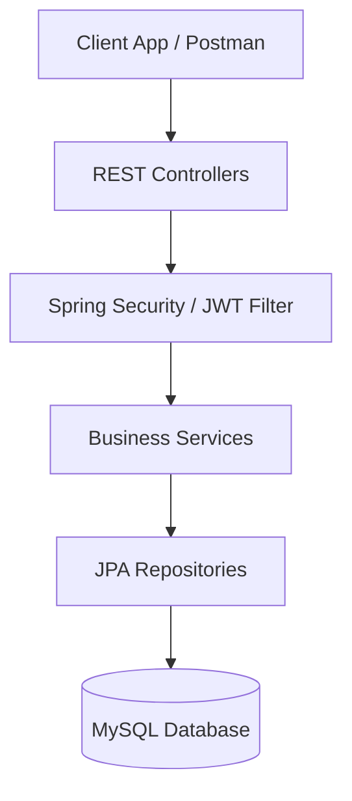

 System


## 📖 Project Overview

**Smart Agriculture Management System** is a robust backend solution engineered to empower farmers with data-driven decision-making. By leveraging advanced software patterns and automated systems, it facilitates comprehensive crop lifecycle management, granular expense tracking, and intelligent agricultural advisories based on environmental factors and pre-defined agronomic rules.

## ✨ Key Features

- **Robust Security & Role-Based Access Control**: Secure endpoints using JWT authentication, distinguishing access levels between `Admin` and `Farmer` roles.
- **Comprehensive Crop Management**: Full CRUD operations for managing crop lifecycles, from planting to harvesting.
- **Granular Expense Tracking**: Real-time financial monitoring capabilities tied to specific crops and farming activities.
- **Intelligent Rule-Based Advisory Engine**: Automated agricultural suggestions utilizing predefined agronomic rules and environmental data parameters.
- **Automated Irrigation Scheduler**: Scheduled background tasks (`@Scheduled`) to trigger irrigation alerts or mechanisms based on temporal or environmental conditions.
- **Extensible Weather API Integration** *(Optional)*: Capable of incorporating live meteorological data for dynamic advisory formulation.

## 🏗️ System Architecture

The application is designed following a rigorous **N-Tier Architecture**, ensuring clear separation of concerns, high maintainability, and scalability.

- **Controller Layer (API Interface)**: Intercepts incoming HTTP requests, orchestrates validation, and routes to appropriate business logic services.
- **Service Layer (Business Logic)**: Encapsulates core business rules, transaction management (`@Transactional`), and cross-service communication.
- **Repository Layer (Data Access)**: Utilizes Spring Data JPA interfaces for abstracted, boilerplate-free database operations.
- **Security Filter Chain**: Intercepts requests to validate JWT tokens and enforce authorization policies prior to controller execution.


```mermaid
graph TD
    Client[Client App / Postman] --> API[REST Controllers]
    API --> Security[Spring Security / JWT Filter]
    Security --> Services[Business Services]
    Services --> Repositories[JPA Repositories]
    Repositories --> DB[(MySQL Database)]
```

## 🗄️ Database Schema Overview

The relational database schema is normalized to ensure data integrity and query efficiency.

- **Users**: Manages authentication credentials and role assignments (`Farmer`, `Admin`).
- **Crops**: Stores crop metadata (type, planting date, expected harvest). Relates to `Users`.
- **Expenses**: Financial transaction logs associated with specific `Crops`.
- **Advisories**: System-generated or Admin-created agricultural guidelines.
- **IrrigationSchedules**: Configured scheduling constraints for crop hydration.

*(Detailed ERD diagrams can be generated dynamically via JPA tooling).*

## 🔌 API Documentation

Comprehensive API documentation and interactive testing are provided via **Swagger UI (OpenAPI 3.0)**.

Once the application is running, access the documentation interface at:
`http://localhost:8080/swagger-ui.html`

### Sample Endpoints

| Method | Endpoint | Description | Access |
|---|---|---|---|
| `POST` | `/api/auth/login` | Authenticate user and receive JWT | Public |
| `GET` | `/api/crops` | Retrieve all crops for the authenticated farmer | Farmer/Admin |
| `POST` | `/api/crops` | Register a new crop profile | Farmer/Admin |
| `POST` | `/api/expenses` | Log a new expense against a specific crop | Farmer |
| `GET` | `/api/advisories/active` | Retrieve current rule-based advisories | Farmer |

## 🛠️ Installation & Deployment

### 1. Prerequisites
Ensure you have the following installed on your system:
- **Java Development Kit (JDK) 17+**
- **Maven 3.8+**
- **MySQL Server 8.0+**
- **Docker & Docker Compose** (Optional, for containerized deployment)

### 2. Local Development Setup

1. **Clone the repository:**
   ```bash
   git clone https://github.com/your-username/Smart-Agriculture-Management-System.git
   cd Smart-Agriculture-Management-System
   ```

2. **Database Configuration:**
   Create a new MySQL database for the application.
   ```sql
   CREATE DATABASE smart_agriculture;
   ```

3. **Configure Environment Variables:**
   You can set up your `application-dev.yml` or export the necessary environment variables directly. Run the application using the Maven Spring Boot plugin:
   ```bash
   mvn spring-boot:run
   ```

### 3. Required Environment Variables

When running the application, provide the following environment variables:

| Variable | Description |
|---|---|
| `DB_USERNAME` | Your MySQL database username (e.g., `root`) |
| `DB_PASSWORD` | Your MySQL database password |
| `JWT_SECRET_KEY` | A secure Base64 encoded secret key for signing JWT tokens (min 256-bit) |

### 4. Building the JAR

To compile and package the application into a standalone executable JAR:
```bash
mvn clean package -DskipTests
java -jar target/smart-agriculture-0.0.1-SNAPSHOT.jar
```

### 5. Docker Deployment

To run the application along with the MySQL database as Docker containers:
```bash
docker build -t smart-agriculture-app .
docker-compose up --build -d
```
*Note: Make sure to create a `.env` file containing the required environment variables in the project root before running `docker-compose`.*

### 6. Accessing Swagger UI

Once the application is successfully running, the interactive API documentation will be available at:
```text
http://localhost:8080/swagger-ui.html
```

## 🔮 Future Enhancements

The architectural foundation supports rapid integration of advanced capabilities:

- [ ] **AI/ML Crop Yield Prediction**: Integrate Python-based ML models via microservices to forecast yields based on historical data.
- [ ] **Mobile Application Interface**: Develop a React Native or Flutter client for field-ready access.
- [ ] **IoT Sensor Integration**: Ingest real-time soil moisture and NPK sensor data directly into the advisory engine.
- [ ] **Advanced Spatial Data**: Integrate GIS mappings for farm plot visualization.

## 🤝 Contribution Guidelines

We welcome contributions from the community!

1. Fork the repository.
2. Create a feature branch (`git checkout -b feature/AmazingFeature`).
3. Commit your changes utilizing conventional commits (`git commit -m 'feat: Add some AmazingFeature'`).
4. Push to the branch (`git push origin feature/AmazingFeature`).
5. Open a Pull Request detailing the proposed changes and ensuring all tests pass.

## 📄 License

This project is licensed under the MIT License - see the [LICENSE](LICENSE) file for details.